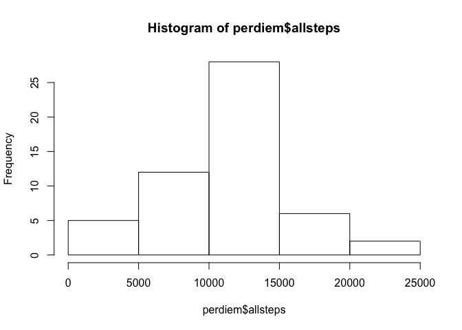
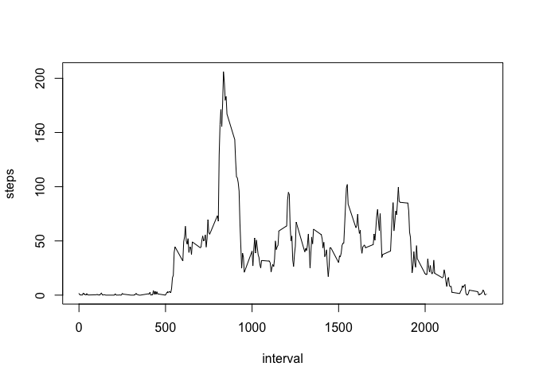
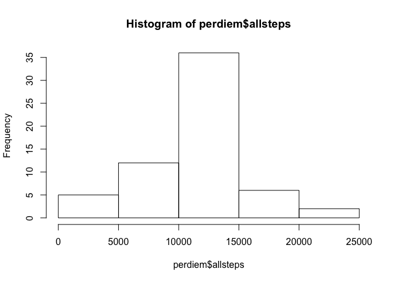
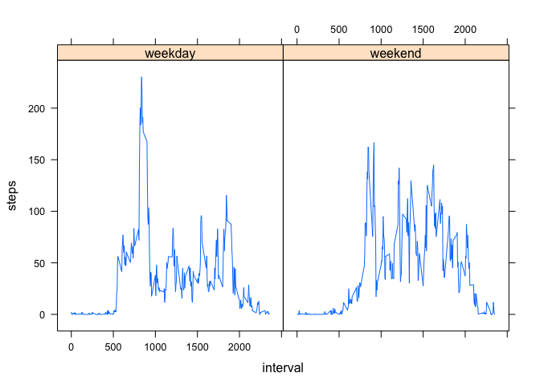

# Reproducible Research: Peer Assessment 1


## Loading and preprocessing the data

Data is available online, as given in the assignment.


Code such as this, would be preferable:

>
> data <- fread("http://d396qusza40orc.cloudfront.net/repdata%2Fdata%2Factivity.zip")
>

However, there are some unsolved memory-related issues with RStudio version 0.99.441, latest version for R version 3.2.0 (2015-04-16) on the x86_64-apple-darwin13.4.0 platform, which throws errors when attempting to unzip the data on the fly with read.csv, comparable to [documented issues](http://stackoverflow.com/questions/22643372/embedded-nul-in-string-error-when-importing-huge-csv-with-fread).

In the mean time, edit the code to point at a local copy of the data.

Parsing and visuals require the packages dplyr, lubridate and lattice.


```r
library(dplyr)
```

```
## 
## Attaching package: 'dplyr'
## 
## The following object is masked from 'package:stats':
## 
##     filter
## 
## The following objects are masked from 'package:base':
## 
##     intersect, setdiff, setequal, union
```

```r
library(lubridate)
library(lattice)

setwd("/Users/drmoreel/GitRepo/RepData_PeerAssessment1/data/")
data <- read.csv(file = "activity.csv", as.is = TRUE)
data$date <- ymd(data$date)
```


## What is mean total number of steps taken per day?


```r
perdiem <- data %>%
  group_by(date) %>%
  summarise(allsteps = sum(steps)) %>%
  filter(allsteps > 0)

hist(perdiem$allsteps)
```

 

The median number of steps taken per day is 

```r
median(perdiem$allsteps)[1]
```

```
## [1] 10765
```
and the mean is 

```r
mean(perdiem$allsteps)[1]
```

```
## [1] 10766.19
```

In these calculations, missing values have been ignored.


## What is the average daily activity pattern?


```r
perinterval <- data %>%
  group_by(interval) %>%
  summarise(steps = mean(steps, na.rm = TRUE)) 

plot(perinterval, type = "l")
```

 

The 5 minute interval with most steps, is 

```r
perinterval$interval[max(perinterval$steps)]
```

```
## [1] 1705
```


## Imputing missing values

There are a number of days/intervals where there are missing values for the steps variable, coded as NA and ignored up till now.

There are exactly 

```r
sum(is.na(data$steps))[1]
```

```
## [1] 2304
```
missing measurements.

We can fill the gaps with the mean for that 5-minute interval, as calculated earlier.


```r
# we need new data where data is missing
newdata <- data %>%
  filter(is.na(steps) == TRUE) %>%
  select(date, interval)
# for those new dates and intervals, 
# we use the mean count of steps for that interval
newdata <- inner_join(x = newdata, y = perinterval, by = "interval")
# remove NA's from data and replace with the new data
data <- filter(data, is.na(steps) == FALSE)
data <- rbind(data, newdata)
# recalculate summary
perdiem <- data %>%
  group_by(date) %>%
  summarise(allsteps = sum(steps)) %>%
  filter(allsteps > 0)

hist(perdiem$allsteps)
```

 

The median number of steps taken per day is now identical to the mean, as an effect of manipulating the dataset:

```r
median(perdiem$allsteps)
```

```
## [1] 10766.19
```

```r
mean(perdiem$allsteps)
```

```
## [1] 10766.19
```


## Are there differences in activity patterns between weekdays and weekends?

One can expect differences between weekdays and weekends. This can be shown visually.


```r
# we expand the dataset with a numeral for the day of the week
# 1 = Sunday
moredata <- data %>%
  mutate(weekday = wday(date))
# replace the numerals with the string as requested in the assignment
moredata$weekday[moredata$weekday == 1] <- "weekend"
moredata$weekday[moredata$weekday == 7] <- "weekend"
moredata$weekday[nchar(moredata$weekday) == 1] <- "weekday"
# create factor variable
moredata$weekday <- as.factor(moredata$weekday)
# calculate summary
groupedperinterval <- moredata %>%
  group_by(weekday, interval) %>%
  summarise(steps = mean(steps, na.rm = TRUE)) 

xyplot(steps ~ interval | weekday, data = groupedperinterval, type = "l")
```

 


